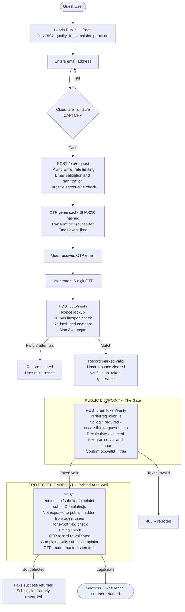

# Complaint Management Portal (CMP): Design Document

**Scope:** `x_77594_quality_fo` | **Platform:** ServiceNow (SDK / Now CLI) | **Status:** In Development

---

## 1. Quick Summary

The Complaint Management Portal (CMP) enables external, unauthenticated users (guest users) to submit complaints through a public-facing web form hosted on ServiceNow: without requiring a ServiceNow account or login.

ServiceNow is built around authenticated sessions. Every platform primitive: ACLs, GlideRecord, REST API Scripts: assumes a logged-in user with a session token and roles. Exposing a public endpoint on this platform requires deliberately stepping outside those assumptions, which creates a distinct attack surface that must be addressed by design, not as an afterthought.

A public endpoint on ServiceNow is exposed to bot spam, OTP brute-force, email injection, and direct API scanning: all without the platform's usual session-based protections. Every layer of the application must assume the client is hostile and validate accordingly. The full risk breakdown is detailed in [Section 3.1](#31-risk-landscape).

### Design Principles

These risks dictate the following core principles:

- **Never trust the client**: every input is validated server-side, regardless of what the UI enforces.
- **Two-step REST pattern ("gold rule")**: only a lightweight token-validation endpoint is public, the data-writing endpoint (`submitComplaint`) stays behind ServiceNow and is never exposed.
- **OTP hashing**: SHA-256 + per-session nonce + application salt (system property).
- **Honeypot fields + timing checks**: bot submissions are silently discarded with a fake success response.
- **Cloudflare Turnstile CAPTCHA**: on the initial OTP request, before any server-side work occurs.
- **IP-based & Email rate limiting**: 3 requests/min, then 1-hour block.
- **Transient OTP records**: per-session GlideRecords, not System Properties, so concurrent users never collide.

---

## 2. Data Model

### 2.1 Tables

| Table Name | SN Table | Purpose |
|---|---|---|
| Scripted REST Service | `sys_ws_definition` | Public REST service definition for token verification (Direct Record pattern) |
| Scripted REST Operation | `sys_ws_operation` | Individual REST endpoints with public access flags |
| OTP Transient Table | `x_77594_quality_fo_data_table_1` | Per-session OTP records: hash, nonce, attempts, valid flag, submission status |
| Complaint Table | `x_77594_quality_fo_complaint` | Submitted complaints, written only via non-public endpoint |

### 2.2 Business Process Flow



> **The gold rule:** `verifyReqToken` is the public gate. `submitComplaint` is the wall. Bots that scan for public endpoints never discover the complaint insertion path.

---

## 3. Security: Risks, Protections & Philosophy

### 3.1 Risk Landscape

| Risk | Description |
|------|-------------|
| Bot spam / automated submissions | Scripts flooding the complaint endpoint with junk data, polluting the complaint table |
| OTP brute-force | Attackers guessing the 6-digit OTP (1M combinations) by hammering the verify endpoint |
| Email header injection | Crafted email addresses containing newlines/semicolons to hijack the OTP email into a spam relay |
| Direct API probing | Bots discovering REST endpoints via enumeration and calling data-writing APIs directly, bypassing the UI entirely |
| CSRF / session riding | Forged requests exploiting the absence of CSRF tokens on public endpoints |
| Replay attacks | Reusing a valid OTP or verification token from a previous session |
| Timing attacks | Bots submitting forms instantly: faster than any human could type |
| Resource exhaustion | Mass OTP requests draining email quotas or flooding the transient table |

### 3.2 Protection Layers

1. **Cloudflare Turnstile CAPTCHA**: First gate on the initial OTP request. Blocks automated scripts before any server-side work happens. Cloudflare analyzes browser behavior, mouse movements, and device signals to distinguish humans from bots, all without a visible puzzle. Skipped on resend since the user already proved human presence.

2. **IP & Email rate limiting**: IP-level: 3 requests/minute, 1-hour block. Email-level: max 3 pending OTP records per email/hour. Prevents both single-source brute-force and distributed attacks targeting one inbox.

3. **Email validation & sanitization**: Regex + length + injection character checks (commas, semicolons, newlines). Blocks header injection before the email is ever constructed or sent.

4. **OTP hashing (SHA-256 + nonce + salt)**: The OTP code is never stored. Instead, it is combined with a per-session random string and a secret key, then hashed into an irreversible fingerprint. Only the fingerprint is saved. Full explanation in [Section 3.4](#34-understanding-sha-256-hashing) below.

5. **Attempt tracking (max 3)**: The transient OTP record tracks failed verify attempts. After 3 failures, the record is deleted. No unlimited guessing is possible.

6. **Verification token (server-derived HMAC)**: After OTP verification, a token is generated server-side as `SHA256(record_id + salt)`. It is re-derived and compared on the next step: it cannot be forged or reused for a different record.

7. **Two-step REST pattern ("gold rule")**: Only `verifyReqToken` is public (accessible without login). The data-writing endpoint `submitComplaint` stays behind ServiceNow's standard auth layer. Bots probing public endpoints never discover the complaint insertion path.

8. **Honeypot fields + timing check**: Hidden `last_name` and `phone_number` fields (invisible to humans, filled by bots) + a `_t` timestamp that catches submissions faster than 2 seconds. Detected bot submissions receive a fake success response: they are silently discarded.

9. **Transient records (not System Properties)**: Each OTP session gets its own GlideRecord. Concurrent users cannot collide or overwrite each other's state.

10. **OTP record lifecycle**: After complaint submission, the record is marked `submitted`. The verification token is bound to the record ID: once consumed, it cannot be replayed for a different session.

### 3.3 Security Philosophy

There is no such thing as an impenetrable system: 100% protection does not exist. Our job is to add enough barriers that the cost of attack: in time, compute, and effort: far exceeds any value the attacker could gain. Every layer is a multiplier on the attacker's cost: CAPTCHA filters bots before they reach rate limiting; rate limiting slows down those that get through; hashing protects the data even if the database is stolen; the two-step REST pattern hides the data-writing endpoint so bots never find it. Security is not a feature added at the end: it is a design constraint that shapes every architectural decision from the first endpoint registration.

### 3.4 Understanding SHA-256 Hashing

**What is SHA-256?**

SHA stands for *Secure Hash Algorithm*. The 256 refers to the output size: 256 bits, which is 64 hexadecimal characters. It is a one-way function: you can feed any input in and get a fixed-length fingerprint out, but there is no mathematical way to reverse the fingerprint back into the original input. Even a single character change in the input produces a completely different output (this property is called the *avalanche effect*). SHA-256 is part of the SHA-2 family, designed by the NSA and published by NIST in 2001. It remains unbroken to this day.

**Why not just hash the OTP alone?**

A 6-digit OTP has only 1,000,000 possible values. An attacker could pre-compute all 1 million SHA-256 hashes in under a second and build a lookup table (called a *rainbow table*). If they steal the database, they just look up the hash and find the OTP instantly. To prevent this, we add two extra ingredients before hashing:

- **Nonce** (Number used ONCE): a 32-character cryptographically random string, unique to each OTP session. Because every session has a different nonce, the same OTP code produces a different hash every time. This makes pre-computed rainbow tables useless since the attacker would need a separate table for every possible nonce, which is computationally impossible.
- **Salt**: a secret key stored in a ServiceNow Encrypted System Property (never in the database). Even if an attacker dumps the entire database and sees both the hash and the nonce, they still cannot recompute the hash without knowing the salt. It is the last line of defense.

**How it works in practice:**

```
hash = SHA256( OTP + nonce + salt )
        ↓         ↓        ↓
     "483921"  "a8f2...x9"  "[secret]"
        ↓
     "e3b0c44298fc1c149afb..." (64 hex chars, irreversible)
```

Only the hash is stored in the database. The OTP itself is never written anywhere. When the user submits their code, the server recombines it with the stored nonce and the salt, runs SHA-256 again, and compares the result to the stored hash. Match = verified. No match = wrong code.

**Entropy perspective:**

The OTP alone has ~20 bits of entropy (2²⁰ ≈ 1,000,000). The nonce adds ~128+ bits. Combined with the salt, the effective input space is far beyond what any brute-force attack can cover. The output is always 256 bits regardless of input size.

See also [Section 7.3](#73-sha-256-hashing-deep-dive) for the implementation-level breakdown including the component table and post-verification cleanup.

---

## 4. Frontend Architecture

### 4.1 Frontend Decision Overview

Two primary frontend approaches were evaluated for implementing the public complaint portal:

1. **React SPA** using ServiceNow SDK (Now CLI) + UI Page
2. **ServiceNow Service Portal** (AngularJS-based widgets)

The final solution uses a **React Single Page Application (SPA)** delivered via a public UI Page.

### 4.2 Why Not Service Portal?

| Concern | Detail |
|---------|--------|
| **Security control** | Service Portal widgets run inside ServiceNow's AngularJS framework, which automatically injects session tokens, `g_ck` CSRF headers, and widget server scripts. For a public page serving guest users, this implicit session machinery is a liability: it is designed for authenticated users and creates ambiguity about what is actually protected. React + explicit REST calls give full, transparent control over every header and payload. |
| **Public access model** | Service Portal pages assume an authenticated session. Making them truly public requires workarounds: public widgets, guest user roles, ACL gymnastics. A UI Page registered in `sys_public` is a cleaner, more auditable boundary. |
| **Framework age** | AngularJS is end-of-life. ServiceNow is actively moving away from it. |
| **Tooling** | No access to modern frontend tooling: Vite, TypeScript, component testing frameworks. |

### 4.3 Why SDK + React?

- ServiceNow's **Now Experience / Next Experience framework** is built on web components and modern JavaScript. React is the recommended approach for new external-facing development.
- The **ServiceNow SDK (Now CLI)** provides first-class support for React builds, bundling, and deployment to UI Pages.
- React provides: component-based architecture, TypeScript support, modern state management, and a rich ecosystem for security libraries.
- The SDK's `UiPage` registration + `sys_public` entry provides a clean, auditable public access path: no hidden session magic.

### 4.4 Technical Details

**Delivery:**

```
URL:         https://<instance>.service-now.com/x_77594_quality_fo_complaint_portal.do
sys_public:  Registered: allows unauthenticated access
SDK:         UiPage in src/fluent/ui-pages/complaint-portal.now.ts (direct: true)
```

#### 4.4.1 Key Frontend State Variables

| State | Type | Description |
|-------|------|-------------|
| `step` | `string` | Current UI step: `verify` (email + OTP entry) → `form` (complaint submission) |
| `email` | `string` | User's email address |
| `nonce` | `string` | Server-returned nonce: used internally to correlate the OTP verify call |
| `verificationToken` | `string` | Returned after successful OTP verify. Proves OTP was validated. Prevents reuse of the same OTP for multiple submissions. |
| `recordId` | `string` | `sys_id` of the OTP transient record: links the entire session |
| `formFields` | `cmpForm` | Honeypot fields (`last_name`, `phone_number`) + timing stamp (`_t`) |
| `error` | `string` | Current error message displayed to the user |
| `loading` | `boolean` | Loading/spinner state during async calls |

#### 4.4.2 Component Structure

```
App (app.tsx)
├── State: step, email, nonce, recordId, verificationToken, formFields, error, loading
├── Handlers: handleRequestOtp, handleResendOtp, handleVerifyOtp, handleSubmitComplaint
│
├── [step = "verify"]
│   └── VerificationForm
│       ├── Props: nonce, loading, error, onRequestOtp, onResendOtp, handleVerifyOtp, getSiteKey
│       ├── Email input + submit
│       ├── CloudflareTurnstile (CAPTCHA widget)
│       └── OTP input + verify (shown when nonce exists)
│
└── [step = "form"]
    └── ComplaintForm
        ├── Props: formFields, setFormFields, onSubmit, loading, error
        ├── Honeypot fields (hidden, aria-hidden, tabIndex=-1)
        ├── Hidden _t timestamp
        └── Complaint fields + submit button
```

**Services layer**: separated from components for clean separation of concerns:

```
services/
├── otpService.ts        → requestOtp(), verifyOtp()      → /api/.../cmp_otp/otp/*
├── complaintService.ts  → verifyRequestToken(),           → /api/.../req_token/verify
│                          submitComplaint()               → /api/.../complaint/submit_complaint
└── turnstileService.ts  → getTurnstileSiteKey()           → /api/.../cmp_otp/turnstile/key
```

> All fetch calls omit `X-UserToken` / `g_ck`: guest users have no CSRF (Cross-Site Request Forgery) token, since they are not logged in and have no session to protect. All responses are unwrapped from ServiceNow's `{ result: ... }` envelope.

---

## 5. ACL Strategy: Zero ACLs by Design

### 5.1 The "Zero ACLs" Approach

The CMP uses a deliberate **Zero ACL** strategy at the application logic layer. Security is enforced entirely through API-level controls and server-side script logic: not through ServiceNow's ACL framework.

**Why:**

- **Guest users have no roles**: ServiceNow ACLs are designed for *users of the system* (people who log in with a session, roles, and a user record). Guest users are none of these. They have no session, no roles, no identity. Assigning a `public` role to a table ACL means "anyone on the internet can access this table", which can be a disaster if applied carelessly. One misconfigured public ACL on a sensitive table exposes it to every visitor, bot, and crawler. The ACL system was never built with anonymous internet traffic in mind.
- **API → Script → Table chain**: Access flows through a controlled pipeline. The REST endpoint validates the request, the Script Include executes business logic, and only then does it write to the table. The script is the gatekeeper, not the ACL.
- **`setWorkflow(false)` everywhere**: Every `GlideRecord` insert/update calls `setWorkflow(false)`. This disables business rules, ACL evaluation, and workflow triggers on that operation. In a guest context, ACL evaluation would fail or behave unpredictably: this call makes the script's intent explicit.

| Layer | What It Does | Example |
|-------|-------------|---------|
| **REST API endpoint** | Validates input, checks tokens, enforces rate limits | `verifyReqToken.js` validates `verification_token` + confirms `otp.valid` |
| **Script Include** | Executes business logic, hashing, queries | `OTPVerificationUtil.verifyHandshake()` checks hash, attempts, expiry |
| **GlideRecord + `setWorkflow(false)`** | Writes to table with ACL/BR bypassed | `rec.insert()`: no ACL eval, no business rule interference |

### 5.2 The OTP Transient Table

The OTP transient table (`x_77594_quality_fo_data_table_1`) has **no ACLs**. There are no public role grants on this table. Access is controlled entirely through the API and script layer described above, with `setWorkflow(false)` bypassing ACL evaluation on every GlideRecord operation.

### 5.3 No Frontend Validation

> **All validation is server-side. The frontend performs zero security checks.**

The React client is a thin presentation layer: it sends raw user input to the API and displays whatever comes back. Email format, OTP correctness, token validity, rate limits, honeypot detection: all enforced in the REST handlers and Script Includes. A bot that bypasses the UI entirely hits the exact same validation chain.

---

## 6. REST API: Endpoint Reference

### 6.1 Overview

| # | Controller | Endpoint | Method | Auth |
|---|-----------|----------|--------|------|
| 1 | `cmp_otp` | `/api/x_77594_quality_fo/cmp_otp/otp/request` | POST | Public |
| 2 | `cmp_otp` | `/api/x_77594_quality_fo/cmp_otp/otp/verify` | POST | Public |
| 3 | `req_token` | `/api/x_77594_quality_fo/req_token/verify` | POST | Public (Direct Record) |
| 4 | `complaint` | `/api/x_77594_quality_fo/complaint/submit_complaint` | POST | **Not public (hidden from guests)** |

### 6.2 Endpoint Details

---

**Endpoint 1: Request OTP**

- **Handler:** `src/server/rest api/requestOtp.js`
- **Input:** `{ email, resend?: "true", turnstile_token?: string }`

| Step | Logic |
|------|-------|
| 1 | IP & Email rate-limit check (IP: 3/min, 1hr block; Email: 3 pending/hr) via `isIPBlocked()` + `isEmailOverLimit()` |
| 2 | Email validation: trim, lowercase, regex, length, injection character check |
| 3 | Turnstile CAPTCHA validation via `TurnstileValidator.validate()`: skipped on resend |
| 4 | Email-level rate limit via `OTPVerificationUtil.isEmailOverLimit()` (max 3 pending/hr) |
| 5 | Generate OTP + nonce + hash → insert transient record via `createHandshake()` / `resendHandshake()` |
| 6 | Fire email event `x_77594_quality_fo.otp_requested` |

- **Output (success):** `{ sent: true, nonce }`: nonce returned to client for the verify step
- **Output (error):** `{ error, message }` with HTTP `400` / `403` / `429`

---

**Endpoint 2: Verify OTP**

- **Handler:** `src/server/rest api/verifySubmit.js`
- **Input:** `{ nonce, otp }`

| Step | Logic |
|------|-------|
| 1 | Lookup transient record by nonce |
| 2 | Check 10-minute lifespan expiry |
| 3 | Re-hash user's OTP with stored nonce + salt → compare to stored hash |
| 4 | On mismatch: increment attempts; delete record after 3 failures |
| 5 | On match: mark `verified = true`, clear hash + nonce fields, generate `verification_token` |

- **Output (success):** `{ valid: true, verification_token, record_id, message }`
- **Output (error):** `{ valid: false, message }` with remaining attempts count

---

**Endpoint 3: Verify Request Token**

- **Handler:** `src/server/rest api/verifyReqToken.js`
- **Input:** `{ record_id, verification_token }`

| Step | Logic |
|------|-------|
| 1 | Re-derive expected token server-side: `SHA256(record_id + salt)` |
| 2 | Compare with client-submitted token |
| 3 | Fetch OTP record: must exist and have `valid = true` |

- **Output (success):** `{ status: "verified", record_id }`
- **Output (error):** `{ error }` with HTTP `400` / `403`

> **This is the public gate: the "gold rule" entry point.** Registered via the Direct Record pattern as a public endpoint (no login required). It validates the chain to this point but writes nothing.

---

**Endpoint 4: Submit Complaint**

- **Handler:** `src/server/rest api/submitComplaint.js`
- **Input:** `{ record_id, last_name, phone_number, _t }` *(honeypot fields: no `verification_token`)*

| Step | Logic |
|------|-------|
| 1 | Honeypot check: `last_name` or `phone_number` filled → fake success |
| 2 | Timing check: `_t` indicates < 2 seconds since form load → fake success |
| 3 | Fetch OTP record: must exist and be valid (defense in depth) |
| 4 | Delegate to `ComplaintsUtils.submitComplaint()` for actual record insert |
| 5 | Mark OTP record `submission_status = "submitted"` |

- **Output (success):** `{ status: "success", message, reference_number, record_id }`
- **Output (honeypot):** `{ status: "success", reference_number: "REF<random>" }`: fake success; submission silently discarded

> **This endpoint is NOT public.** It sits behind ServiceNow's standard auth/ACL layer. Bots scanning public endpoints never discover the complaint insertion path.

---

## 7. Script Includes: Service Layer

One Script Include per domain entity: clean separation of concerns, each responsible for its own business logic.

### 7.1 Overview

| Script Include | Scope API Name | Responsibility |
|---------------|---------------|----------------|
| `OTPVerificationUtil` | `x_77594_quality_fo.OTPVerificationUtil` | OTP lifecycle: generation, hashing, rate limiting, verification, token generation |
| `ComplaintsUtils` | `x_77594_quality_fo.ComplaintsUtils` | Complaint record creation and field mapping |
| `TurnstileValidator` | `x_77594_quality_fo.TurnstileValidator` | Cloudflare Turnstile credential access + server-side token validation |

### 7.2 OTPVerificationUtil: Key Functions

| Function | Responsibility |
|----------|---------------|
| `generateOTP()` | Generates 6-digit OTP using `GlideSecureRandomUtil.getSecureRandomInt()` (CSPRNG: not `Math.random`). Zero-padded to always be exactly 6 digits. |
| `generateNonce()` | Generates 32-character cryptographically secure random string via `GlideSecureRandomUtil.getSecureRandomString(32)`. Used as per-session binding. |
| `hashComponents(otp, nonce, salt)` | SHA-256 hash of `otp + nonce + salt`. The core security primitive: see §7.3. |
| `isIPBlocked(clientIP)` | IP rate limiter: counts hits in last 60s, blocks for 1 hour after 3. Uses transient table markers (`__ip_rate:`, `__ip_block:`). |
| `isEmailOverLimit(email)` | Email rate limiter: max 3 pending (unverified) records per email per hour. Uses `GlideAggregate` for a DB-side COUNT: avoids loading records into memory. |
| `createHandshake(email)` | Full OTP flow: rate check → generate OTP/nonce/hash → insert record (10-min expiry) → fire email event. Returns `{ nonce }`. |
| `resendHandshake(email)` | Resend OTP on existing record: 60-second cooldown, regenerates OTP/nonce/hash in-place. Does not consume a new rate-limit slot. |
| `verifyHandshake(nonce, userOtp)` | Verify OTP: lookup by nonce → check expiry → re-hash user input → compare → max 3 attempts. On success: mark verified, clear hash/nonce, return `verification_token`. |
| `generateVerificationToken(recordSysID)` | Generates `SHA256(recordSysID + salt)`. Binds the token to a specific record: cannot be reused for another session. |

### 7.3 SHA-256 Hashing: Deep Dive

#### Why SHA-256 for OTP?

An OTP has only 1,000,000 possible values (000000–999999). Storing it in plaintext: or any reversible encoding: means a database breach instantly compromises every active OTP. Hashing converts the OTP into a fixed-length digest that cannot be reversed.

SHA-256 of a 6-digit number **alone** is trivially crackable: an attacker can pre-compute all 1M hashes in milliseconds (a rainbow table attack). The defense is **multi-component hashing**:

```
hash = SHA256(otp + nonce + salt)
```

| Component | Source | Stored in DB? | Purpose |
|-----------|--------|--------------|---------|
| `otp` | `GlideSecureRandomUtil` (CSPRNG) | **Never**: only the hash | The secret the user receives and enters |
| `nonce` | `GlideSecureRandomUtil.getSecureRandomString(32)` | Yes (cleared after verify) | Per-session randomness: ensures the same OTP in two different sessions produces entirely different hashes. Defeats rainbow tables. |
| `salt` | Encrypted System Property `x_77594_quality_fo.otp.secret_salt` | **Never in DB**: lives in system properties only | Application-wide secret: even a full transient table dump cannot produce valid hashes without it. |

#### Entropy Analysis

| Input | Entropy |
|-------|---------|
| OTP alone | ~20 bits (10⁶ ≈ 2²⁰): easily broken by brute force |
| Nonce | ~128+ bits (`GlideSecureRandomUtil`, 32 chars) |
| Salt | Unknown length, unknowable value: adds an irreducible unknown |
| Combined → SHA-256 | Effective 256-bit output space: pre-computation infeasible |

#### Properties That Make This Approach Correct for OTP

1. **One-way**: Cannot reverse the hash to recover the OTP.
2. **Deterministic**: Same inputs always produce the same hash (required for verification).
3. **Avalanche effect**: A single-digit change in the OTP produces a completely different hash.
4. **Pre-computation resistance**: Per-session nonce + application salt make rainbow tables useless.
5. **No secret storage**: The OTP is never written to any database, log, or property. Only the hash exists, and only temporarily.
6. **Post-verification cleanup**: After successful OTP verify, both `hash` and `nonce` are cleared from the record. The `verification_token` for the next step is derived from `SHA256(recordSysID + salt)`: a completely different input. Capturing the OTP hash reveals nothing about the verification token.

### 7.4 ComplaintsUtils

Single-function Script Include:

- **`submitComplaint(otpRecordId, body)`**: Inserts a new record into `x_77594_quality_fo_complaint`.
- Field mapping is **TODO**: pending complaint table column finalization.
- Returns `{ sys_id, reference_number }`.
- OTP record lifecycle (marking `submitted`) is handled by the REST handler, not here. `ComplaintsUtils` is responsible only for the insert.

### 7.5 TurnstileValidator

| Function | Responsibility |
|----------|---------------|
| `getTranstileCredentials()` | Returns `{ key, secret }` from System Properties. The REST endpoint returns **only** `key` to the browser: `secret` is never exposed client-side. |
| `validate(token)` | Server-side POST to `https://challenges.cloudflare.com/turnstile/v0/siteverify` with secret + token + client IP. Returns `{ success, error_codes }`. Uses `sn_ws.RESTMessageV2` (ServiceNow's server-side HTTP client). |

---

## 8. Future Recommendations: QR Code Integration

### 8.1 Concept

If the food producer can print a **QR code** on product packaging, it can link directly to the complaint portal with the product ID pre-filled:

```
https://<instance>.service-now.com/x_77594_quality_fo_complaint_portal.do?product_id=<product_sys_id>
```

### 8.2 Advantages

1. **Zero-friction entry**: Consumer scans the QR code → lands on the complaint form with the product already identified. No searching, no dropdowns, no manual entry.
2. **Accurate product identification**: The `product_id` is embedded at print time by the producer, eliminating user error (wrong product selected, typos in batch numbers).
3. **Traceability**: QR codes can embed batch/lot information, linking each complaint not just to a product but to a specific production run, factory, or date: critical for recall scenarios.
4. **Analytics**: QR scan rates per product/batch provide a passive quality signal. A sudden spike from a specific batch is an early warning, even before complaints are fully submitted.
5. **Offline-to-online bridge**: The physical product becomes the entry point to the digital complaint process. No URL to remember, no portal to navigate.
6. **Tamper evidence**: The QR code is printed by the producer. The `product_id` is validated server-side against the product catalog: a fabricated QR code with a non-existent product ID is rejected.
7. **Mobile-first**: QR scanning is a native capability on all modern smartphones. The portal is already a responsive React SPA: the experience from scan to submission is seamless.

### 8.3 Implementation Notes

- React app reads `product_id` from URL query params on load.
- Pre-populates the product field in `ComplaintForm` as read-only.
- Server-side: `product_id` is validated against the product catalog table before the complaint is accepted.
- The QR code contains no sensitive data: only a URL with a public product identifier.

---

*Document generated from source: `x_77594_quality_fo` SDK project. Last updated: 2026-04-02.*
